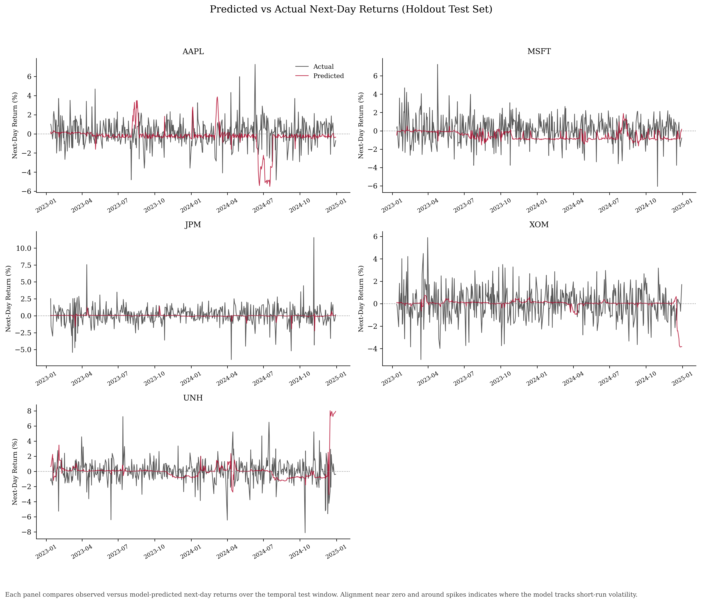

# Can yesterday's trading data predict tomorrow's stock returns?

## Evaluating Technical Indicators Against Market Noise
Every weekday, billions of shares change hands across U.S. stock exchanges.
Most Americans have money tied to those movements through retirement accounts
or savings plans, even if they never actively trade a single share. Whether
it is possible to look at today's market data and make a reliable guess about tomorrow's price changes has been a question that economists have struggled with for decades. I

## The Bottleneck in Market Forecasting
Financial markets are highly noisy, and prediction models frequently overstate
accuracy due to methodological flaws like look-ahead bias, overlapping training
data, and survivorship bias. Determining if future price movements can be
mathematically anticipated from historical data remains a central challenge.

## A Machine Learning Solution for Financial Data
We have developed a data-driven Machine Learning pipeline that rigorously evaluates ten years of historical trading records (2015–2025) across five major U.S. companies. Instead of relying on raw prices, our ML system calculates complex technical indicators such as moving averages to predict next-day percentage returns. By training a Random Forest model strictly on past data and testing it exclusively on the most recent 20% of trading days data the model has never seen the pipeline automatically isolates predictive signals from random market drift. This ensures an honest evaluation of short-term stock volatility.

## Visualizing the Solution: Model Performance
The accompanying chart demonstrates the difficulty in predicting stock returns. By evaluating Root Mean Squared Error (RMSE), Mean Absolute Error (MAE), and R-squared (R²), the Random Forest model's predictions are compared against a naive baseline that assumes zero price change every day. The results indicate that while the model can successfully tracks broad volatility spikes, it struggles to significantly outperform the zero-return baseline, acting much more conservative and reflecting the highly random nature of financial markets. This proves our ML pipeline can be used to quantify the strict limitations of historical technical indicators. With future refinements in feature engineering utilizing context from economic news and more context, this ML tool can be used as a supplemental decision-making resource for traders and analysts.
